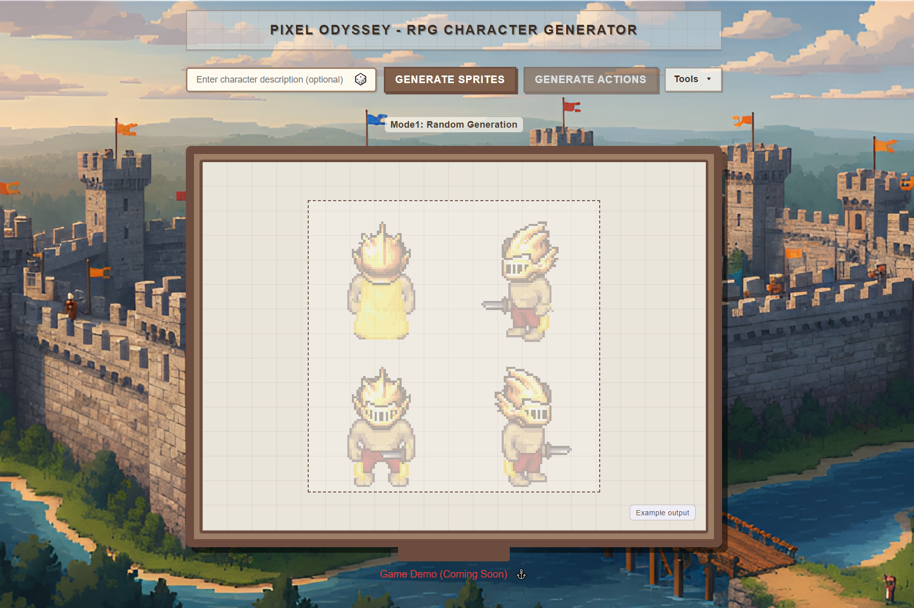
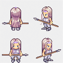
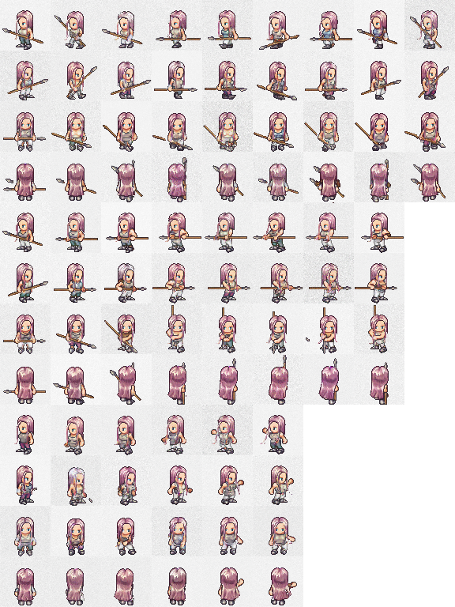
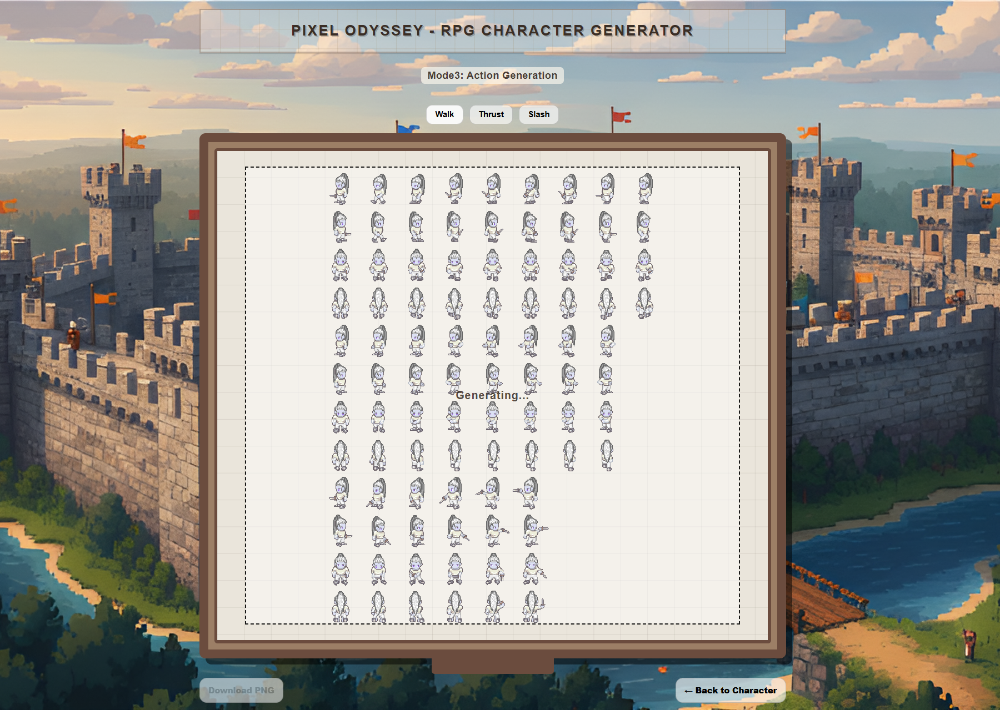

# PIXEL-T2I  
**Structured Pixel-Art Diffusion for RPG Characters and Actions**

<p align="center">
  
</p>

PIXEL-T2I is a research-oriented diffusion system for generating **LPC-style pixel-art RPG characters and action spritesheets**.  
The project focuses on **low-resolution, highly structured image generation**, combining dataset construction, multiple conditioning strategies, and a local interactive web interface.

It supports **unconditional**, **text-conditional**, and **image-conditional** diffusion pipelines, with a strong emphasis on **reproducibility, modular design, and controllable sprite outputs**.

---

## What This Project Does

PIXEL-T2I explores how diffusion models can be adapted to **pixel-art sprite pipelines**, where:

- Images are **very low resolution** (e.g. 64×64 tiles)
- Outputs must follow **strict spatial structure**
- Generation must be **controllable and composable**

The system can:

- Generate **4-view RPG character sprites** (north / south / west / east)
- Generate **action spritesheets** (walk / thrust / slash)
- Compare **different conditioning strategies** under a unified diffusion framework
- Serve models through a **local web interface** for interactive experimentation

### Example Outputs

<table align="center">
  <tr>
    <!-- Left: 4-view -->
    <td align="center" valign="top">
      <sub>4-View Character</sub><br/><br/>
      
    </td>
    <!-- Spacer column -->
    <td width="60"></td>
    <!-- Right: action sheet -->
    <td align="center" valign="top">
      <sub>Action Spritesheet</sub><br/><br/>
      
    </td>
  </tr>
</table>

---

## Interactive Web Interface

PIXEL-T2I includes a local web-based interface that allows users to
interactively generate characters and action spritesheets using the
trained diffusion models.

The interface supports switching between **character generation**
and **action generation** modes, providing a unified workflow for
sprite creation and inspection.

<p align="center">
  
</p>

---

## Core Components

### 1. Dataset Construction  
A complete pipeline for building LPC-style datasets from layered sprite assets:

- 4-view character extraction
- Caption generation and optimisation
- Action spritesheet assembly
- Dataset preview and inspection tools

### 2. Diffusion Model Training  
Three progressively more constrained diffusion models:

1. **Unconditional diffusion** (baseline diversity and convergence)
2. **Text-conditioned diffusion** (caption-guided control)
3. **Image-conditioned diffusion** (action generation from character appearance)

All models share a consistent architectural and training setup to enable
controlled comparison.

### 3. Structured Action Generation  
Instead of generating free-form images, the image-conditional model predicts
**individual animation tiles**, which are assembled into a full LPC-style
action spritesheet during inference.

### 4. Local Web Application  
A lightweight frontend + FastAPI backend that allows users to:

- Generate characters interactively
- Switch between conditioning modes
- Preview and download generated sprites
- Demonstrate the end-to-end system locally (GPU recommended)

---

## Repository Structure

```
PIXEL-T2I/
├── experiments/              # Training notebooks (diffusion experiments)
├── models/                   # Model definitions & inference code
├── outputs/                  # Training logs and qualitative samples
├── pixel_character_dataset/  # Dataset construction & demo samples
├── scripts/                  # Dataset, analysis, and release utilities
├── webapp/                   # Local web interface (frontend + backend)
├── reports/                  # Project reports and evaluation
├── assets/                   # Documentation and README visual assets
├── requirements.txt          # Python dependencies for training and inference
└── README.md                 # This file
```

### Directory Roles (High-Level)

- **`experiments/`**  
  Jupyter notebooks used to **train and evaluate diffusion models**.  
  Not used for runtime inference or the web demo.

- **`models/`**  
  Inference-ready implementations of unconditional, text-conditional,
  and image-conditional diffusion models.  
  Pretrained weights are distributed separately.

- **`outputs/`**  
  Training artefacts only: loss logs and qualitative samples generated
  during experiments.

- **`pixel_character_dataset/`**  
  Dataset hub containing demo samples, dataset structure definitions,
  and instructions for reproducing datasets from raw LPC assets.

- **`scripts/`**  
  Offline utilities for dataset construction, caption optimisation,
  training analysis, and model release packaging.

- **`webapp/`**  
  Local interactive system combining a static frontend and a FastAPI
  backend for model inference and demonstration.

- **`reports/`**  
  Project reports, evaluation results, and figures used for
  experimental analysis and reporting.

- **`assets/`**  
  Static visual assets used for README and project documentation.

Each directory contains its own README with detailed explanations and usage notes
(where applicable).

---

## Training vs Inference

This repository clearly separates **research training** from **runtime usage**:

- **Training & evaluation:**  
  Conducted in `experiments/` using Jupyter notebooks and external GPUs.

- **Inference & demo:**  
  Performed via scripts in `models/` or through the local web app in `webapp/`.

This separation keeps the codebase modular, reproducible, and easy to reason about.

---

## Pretrained Models

Pretrained model weights are **not committed directly** to the repository.

They are distributed via **GitHub Releases** as compressed archives.

To install pretrained weights:

1. Download the release archive (e.g. `pixel_t2i_weights_v0.x.x.zip`)
2. Place it in the repository root (`PIXEL-T2I/`)
3. Run:
   ```bash
   python scripts/v1_extract_weights_zip.py
   ```

The script will extract weights into the correct `models/*/checkpoints/` directories.

---

## Running the Web Demo

The recommended way to interact with the system is via the **local web interface**.

See detailed instructions in:
`webapp/README.md`

In short:

- GPU acceleration is **strongly recommended**
- The backend loads **multiple diffusion models** on startup
- The system is designed for **local experimentation**, not public deployment

---

## Intended Audience

This project is intended for:

- Research and coursework projects involving **generative models**
- Experiments on **structured image generation**
- Developers interested in **pixel-art ML pipelines**
- Students exploring diffusion beyond natural images

It is **not** intended as a production-ready game asset generator.

---

## License and Attribution

This project builds on LPC-style pixel-art assets derived from the  
**Universal LPC spritesheet**.

All original licensing terms apply:

- Attribution required
- Share-alike for derivative works

Refer to `pixel_character_dataset/README.md` for full attribution details.
