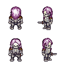
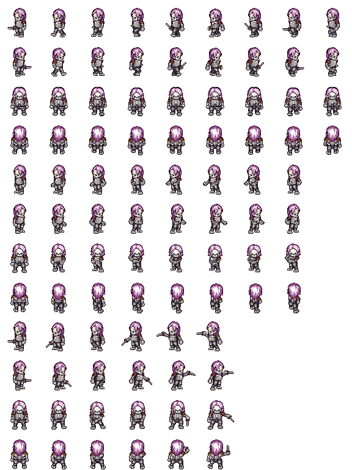

# PIXEL-T2I Character Dataset

This directory contains the character datasets used in the **PIXEL-T2I** project
for training diffusion models on LPC-style pixel-art characters and actions.

It serves as the central data hub for both **4-view character appearance
generation** and **image-conditional action generation**, and supports dataset
reproduction from raw LPC assets.

---

## Overview

The dataset is organised into three conceptual layers:

1. **Demo data** — small preview samples tracked in the repository.
2. **Processed training datasets** — full training sets provided as external
   compressed archives.
3. **Raw LPC assets** — original sprite resources used to reproduce the datasets
   from scratch.

This separation keeps the repository lightweight while preserving
reproducibility.

---

## Example Samples

**4-view character example:**

<p align="center">
  
</p>

**Action spritesheet example:**

<p align="center">
  
</p>

The action spritesheet encodes three actions — **walk**, **thrust**, and
**slash** — with animation frames provided for all four viewing directions.

---

## Directory Structure

```
pixel_character_dataset/
├── processed/
│ ├── dataset_4view/            # Extracted 4-view training data (external)
│ ├── dataset_actions/          # Extracted action training data (external)
│ ├── demo/                     # Preview samples (tracked in repo)
│ │ ├── character_4view_demo1.png
│ │ ├── character_4view_demo2.png
│ │ ├── character_actions_demo1.png
│ │ └── character_actions_demo2.png
│
├── raw_assets/
│ └── Universal-LPC-spritesheet/  # Original LPC assets (cloned by the user)
│
└── README.md
```

---

## Processed Training Datasets

The full training datasets are **not tracked directly in this repository** due to
their size.

Instead, they are provided as compressed archives via external download links.
After downloading, extract them into the `processed/` directory so that the
structure matches the layout above.

Expected result after extraction:

```
processed/
├── dataset_4view/
└── dataset_actions/
```

Download links:

- **[4-view character dataset](https://drive.google.com/file/d/1Hl6HymRC5lQEIz1kzcAKaAAlb0JdTBzH/view?usp=drive_link)**

- **[Action spritesheet dataset](https://drive.google.com/file/d/1BA0N2Znr8kDkG_-qmWOTLKkyRwiTMsiu/view?usp=drive_link)**

These datasets correspond to the following Hugging Face releases:

- **[LPC 4-View Pixel Art Diffusion Dataset](https://huggingface.co/datasets/carlosuperb/lpc-4view-pixel-art-diffusion)**
- **[LPC Action Pixel Art Diffusion Dataset](https://huggingface.co/datasets/carlosuperb/lpc-action-pixel-art-diffusion)**

---

## Raw Assets and Dataset Reproduction

The `raw_assets/Universal-LPC-spritesheet/` directory is intentionally kept empty
in the repository (tracked using a `.gitkeep` file).

Users who wish to **rebuild the datasets from scratch or extend the dataset
size** can clone the original Universal LPC spritesheet repository into this
location and run the provided preprocessing scripts.

The original LPC assets are available at:
[Universal LPC spritesheet](https://github.com/makrohn/Universal-LPC-spritesheet/tree/7040e2fe85d2cb1e8154ec5fce382589d369bdb8)

This design enables full reproducibility and controlled dataset expansion while
avoiding redistribution of large raw asset files.

---

## Intended Use

This dataset directory is intended for:

- Training **unconditional** and **text-to-image** diffusion models on 4-view
  character sprites.
- Training **image-conditional diffusion models** that generate action
  spritesheets from 4-view character inputs.
- Research and educational experiments involving structured sprite-based
  generative models.

It is designed for model training workflows rather than direct use as a
production-ready asset library.

---

## License and Attribution

All datasets in this project are derived from LPC-style pixel-art resources based
on the **Universal LPC spritesheet**.

The original licensing terms apply:

- Attribution is required.
- Derivative works must be shared under the same license.

Please refer to the original LPC asset repository for full licensing details.
